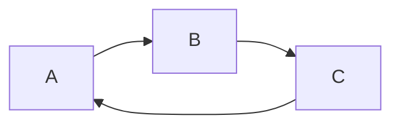

<!-- TODO: update commits timestamps [change timestamps while rebasing](https://stackoverflow.com/a/63751470), [Git rebase without changing commit timestamps](https://stackoverflow.com/a/2976598). -->

# Documentation <!-- omit in toc -->

Tips and tricks to work with Visual Studio Code and the extensions.

## Table of contents <!-- omit in toc -->

- [Visual Studio Code](#visual-studio-code)
  - [Portable mode](#portable-mode)
  - [Settings](#settings)
  - [Command palette](#command-palette)
    - [Key bindings](#key-bindings)
  - [Built-in](#built-in)
    - [Emmets](#emmets)
- [Extensions](#extensions)
  - [General (language independent)](#general-language-independent)
    - [Profile Switcher](#profile-switcher)
    - [Settings Sync](#settings-sync)
    - [Vscode Google Translate](#vscode-google-translate)
    - [Bookmarks](#bookmarks)
    - [Todo Tree](#todo-tree)
    - [Sort lines](#sort-lines)
    - [vscode-random](#vscode-random)
    - [Peacock](#peacock)
    - [Material Icon Theme](#material-icon-theme)
    - [Gremlins tracker for Visual Studio Code](#gremlins-tracker-for-visual-studio-code)
    - [Color Picker](#color-picker)
    - [VS Color Picker](#vs-color-picker)
    - [:emojisense:](#emojisense)
  - [General (languages)](#general-languages)
    - [EditorConfig for VS Code](#editorconfig-for-vs-code)
    - [Prettier - Code formatter](#prettier---code-formatter)
    - [SonarLint](#sonarlint)
    - [Regex Previewer](#regex-previewer)
    - [Paste JSON as Code](#paste-json-as-code)
    - [Rainbow CSV](#rainbow-csv)
  - [Web](#web)
    - [HTMLHint](#htmlhint)
    - [CSS Peek](#css-peek)
    - [Debugger for Firefox](#debugger-for-firefox)
    - [Debugger for Chrome](#debugger-for-chrome)
    - [Turbo Console Log](#turbo-console-log)
    - [Auto Rename Tag](#auto-rename-tag)
    - [npm](#npm)
    - [Import Cost](#import-cost)
    - [Image preview](#image-preview)
  - [Angular](#angular)
    - [TSLint](#tslint)
    - [Angular Language Service](#angular-language-service)
    - [SimonTest](#simontest)
    - [angular2-inline](#angular2-inline)
    - [Angular Snippets (Version 8)](#angular-snippets-version-8)
    - [autoimport](#autoimport)
  - [Markdown](#markdown)
    - [Markdown All in One](#markdown-all-in-one)
    - [Markdown Preview Enhanced](#markdown-preview-enhanced)
    - [markdownlint](#markdownlint)
  - [GitHub](#github)
    - [GitLens — Git supercharged](#gitlens--git-supercharged)
    - [GitHub Pull Requests](#github-pull-requests)
    - [gitignore](#gitignore)
  - [Others](#others)
    - [Code Spell Checker](#code-spell-checker)
    - [Unicode code point of current character](#unicode-code-point-of-current-character)
    - [vscode-pandoc](#vscode-pandoc)
- [Summary](#summary)
- [Links of interest](#links-of-interest)
- [Resources](#resources)

## Visual Studio Code

<!-- TODO: Add word in settings.json. -->

[Docs](https://code.visualstudio.com/docs).

### Portable mode

Follow those steps to use [portable mode](https://code.visualstudio.com/docs/editor/portable) of VSC:

- [Download](https://code.visualstudio.com/download) the `.zip` or `.tar.gz`.
- Unzip and create the `data` folder.
- Create `tmp` folder if you wish to also have `tmp` directory within the portable directory.

To update the portable version, copy or move the `data` folder over to a more recent version of VSC.

### Settings

In addition to the configuration options set in the `settings.json` file, there are others nice options to get known:

- Navigation map: `editor.minimap.enabled`.
- Contextual information interspersed: `editor.codeLens`.
- Working with spaces or tabs: `editor.insertSpaces`, `editor.detectIndentation`, `editor.tabSize`. Usually this will be done by extensions like: Prettier or EditorConfig.
- Customize colors theme ([values](https://code.visualstudio.com/api/references/theme-color)): `workbench.colorCustomizations`.

### Command palette

- Developer: Reload Window: `Ctrl+R`.
- Transform to Uppercase/Lowercase. <!-- Define Keybinding -->

#### Key bindings

Open keyboard shortcuts with: Ctrl+K Ctrl+S. In the `keybindings.json` file we can see the custom keys added. [Docs](https://vscode.readthedocs.io/en/latest/getstarted/keybindings/).

Keybinding list of important ones or most used:

<!-- TODO: set the description text the same in Command Palette -->

| Shortcut             | Description             | Shortcut              | Description                                |
| -------------------- | ----------------------- | --------------------- | ------------------------------------------ |
| `Ctrl+Shift+P`, `F1` | Show All Commands.      | `Alt+LeftArrow`       | Action back.                               |
| `Ctrl+P`             | Search file.            | `Alt+RightArrow`      | Action forward.                            |
| `Ctrl+Shift+F`       | Find in files.          | `Alt+UpArrow`         | Move line up.                              |
| `Ctrl+D`             | Select next occurrence. | `Alt+DownArrow`       | Move line down.                            |
| `Ctrl+Shift+L`       | Select all occurrences. | `Shift+Alt+UpArrow`   | Copy line up.                              |
| `Ctrl+Alt+UpArrow`   | Add cursor above.       | `Shift+Alt+DownArrow` | Copy line down.                            |
| `Ctrl+Alt+DownArrow` | Add cursor below.       | `Ctrl+Ñ`              | Toggle terminal.                           |
| `Ctrl+Space`         | Trigger code suggest.   | `Ctrl+Shift+Ñ`        | Create new terminal.                       |
|                      |                         | `Ctrl+Shift+M`        | Toggle problems (errors, warnings, infos). |

### Built-in

#### Emmets

[Emmets docs](https://code.visualstudio.com/docs/editor/emmet): [examples](https://kungfupress.com/multiplica-tu-velocidad-en-visual-studio-code-utilizando-emmet/).

<!-- markdownlint-disable MD033 -->
<!--
<details>
<summary><code>p*2>lorem5</code></summary>

```html
<p>Lorem ipsum dolor sit amet.</p>
<p>Facere nesciunt at saepe praesentium?</p>
```

</details>
</img>
-->
<!-- markdownlint-enable MD033 -->

```html
<!-- p*2>lorem5 -->
<p>Lorem ipsum dolor sit amet.</p>
<p>Facere nesciunt at saepe praesentium?</p>
```

```html
<!-- ul>li*3>span.myclass#myid>lorem2 -->
<ul>
  <li><span class="myclass" id="myid">Lorem, ipsum.</span></li>
  <li><span class="myclass" id="myid">Deleniti, itaque?</span></li>
  <li><span class="myclass" id="myid">Quis, perferendis.</span></li>
</ul>
```

```html
<!-- ul>li*2>(span.myclass#myid+div)*2 -->
<ul>
  <li>
    <span class="myclass" id="myid"></span>
    <div></div>
    <span class="myclass" id="myid"></span>
    <div></div>
  </li>
  <li>
    <span class="myclass" id="myid"></span>
    <div></div>
    <span class="myclass" id="myid"></span>
    <div></div>
  </li>
</ul>
```

```html
<!-- ul>li.item$@*3 -->
<!-- ul>li.item$@-*3 for countdown -->
<ul>
  <li class="item1"></li>
  <li class="item2"></li>
  <li class="item3"></li>
</ul>
```

## Extensions

If the opposite is not indicated, the configuration is set in `settings.json` file.

Below, there are an extensive list of extensions with their basic functionality and other information.

### General (language independent)

#### Profile Switcher

Control the extensions loaded with [profiles](https://www.aaron-powell.com/posts/2019-07-25-profile-switcher-extensions-support/). Set:

- `profileSwitcher.profiles`: names of saved profiles.
- `profileSwitcher.extensionsIgnore`: extensions available in all the profiles.
- `profileSwitcher.extensions`: extensions for each saved profile.

```json
"profileSwitcher.profiles": ["Angular"],
"profileSwitcher.extensionsIgnore": [],
"profileSwitcher.storage": {
  "Angular": {}
},
"profileSwitcher.extensions": {
  "Angular": []
},
```

[Repository and docs](https://github.com/aaronpowell/vscode-profile-switcher).

#### Settings Sync

Synchronize settings, snippets, themes, file icons, launch, keybindings, workspaces and extensions using GitHub gist. [Configuration](https://shanalikhan.github.io/2019/08/01/Settings-sync-configurations.html).

[Repository and docs](https://github.com/shanalikhan/code-settings-sync).

#### Vscode Google Translate

Translate text with multicursor support.

[Repository and docs](https://github.com/funkyremi/vscode-google-translate).

#### Bookmarks

Mark lines and move around. Basic keybindings:

- Ctrl+Alt+K: set bookmark.
- Ctrl+Alt+[J, L]: jump to previous and next.

[Repository and docs](https://github.com/alefragnani/vscode-bookmarks).

#### Todo Tree

Add tags like `TODO`, `BUG`, `FIXME` and display them in a tree view in the explorer pane.

Basic configuration:

- `todo-tree.general.tags`: list of tags.
- `todo-tree.highlights.defaultHighlight`: default configuration for highlighting.
- `todo-tree.highlights.customHighlight`: custom configuration for tags.

[Repository and docs](https://github.com/Gruntfuggly/todo-tree).

<!--
TODO: qwerty.
FIXME: qwerty.
BUG: qwerty.
@CUSTOM: qwerty.
-->

#### Sort lines

Sort lines of text with multiple methods: alphabetically, length, shuffle, etc.

[Repository and docs](https://github.com/Tyriar/vscode-sort-lines).

<!-- TODO: Solve the multiple keybinding F9. -->

#### vscode-random

Generate random data: numbers, strings, colors, cities, etc.

[Repository and docs](https://github.com/jrebocho/vscode-random).

#### Peacock

Change the color of the workspace. Useful to identify the project when multiple instances of VSC are open.

[Repository](https://github.com/johnpapa/vscode-peacock) and [docs](https://papapeacockstorage.z13.web.core.windows.net/).

#### Material Icon Theme

Folder and file icons theme.

Activate the extension: `"workbench.iconTheme": "material-icon-theme"`

[Repository and docs](https://github.com/PKief/vscode-material-icon-theme).

#### Gremlins tracker for Visual Studio Code

Display gremlins, invisible and ambiguous unicode characters, in the _Problems pane_: `"gremlins.showInProblemPane": true`

[Repository and docs](https://github.com/nhoizey/vscode-gremlins).

#### Color Picker

Improved color palette GUI and multicursor actions: `Pick Color` and `Convert Color`.

[Repository and docs](https://github.com/anseki/vscode-color).

#### VS Color Picker

Color picker with palette and color chooser tool that allows you to pick a color from screen.

[Repository and docs](https://github.com/leehooi/vs-color-picker).

#### :emojisense:

### General (languages)

#### EditorConfig for VS Code

Enable EditorConfig support for Visual Studio Code. It overrides user/workspace settings with the ones found in `.editorconfig` file.

[Repository and docs](https://github.com/editorconfig/editorconfig-vscode).

#### Prettier - Code formatter

Format code of multiple languages: TypeScript, HTML, SCSS, Java, JSOSN and JSONC, etc. Prettier can not format `settings.json` [#1032](https://github.com/prettier/prettier-vscode/issues/1032#issuecomment-579504800).

[Integration with linters (ESLint, TSLint, Stylelint)](https://prettier.io/docs/en/integrating-with-linters.html)

[Repository and docs](https://github.com/prettier/prettier-vscode).

#### SonarLint

[Repository and docs]().

#### Regex Previewer

[Repository and docs]().

#### Paste JSON as Code

Convert JSON to a different languages creating the classes to serialize/deserialize the object. It supports: TypeScript, Python, Java, etc.

[Repository and docs](https://github.com/quicktype/quicktype).

#### Rainbow CSV

Add key features to work with separated value files (available separators `\t`, `,`, `;`, `|`): highlight and align columns, select column, run queries in SQL-like language, CSVLint, etc.

[Repository and docs](https://github.com/mechatroner/vscode_rainbow_csv).

### Web

#### HTMLHint

#### CSS Peek

#### Debugger for Firefox

#### Debugger for Chrome

#### Turbo Console Log

#### Auto Rename Tag

#### npm

#### Import Cost

#### Image preview

Show image preview in the gutter and on hover. Works with URL and relative paths.

[Repository and docs](https://github.com/kisstkondoros/gutter-preview).

### Angular

#### TSLint

#### Angular Language Service

#### SimonTest

#### angular2-inline

#### Angular Snippets (Version 8)

#### autoimport

### Markdown

Pandoc have some install requirements to work with it: [Pandoc](https://pandoc.org) and [MiKTeX](https://miktex.org/) (for _pdflatex_).

<!-- TODO: Solve the multiple keybinding Ctrl+K V. -->

#### Markdown All in One

#### Markdown Preview Enhanced

Basic features: export to different outputs (PDF, HTML, image,...), math expressions, flow charts, sequence diagrams, graphs, run code chunks. It is better to export with _Chrome (Puppeteer)_ because it prints the diagrams (unlike Pandoc and others).



Enable execution of code chunks with `enableScriptExecution` but do it with caution because of security risks.

```javascript {cmd="node"}
console.log(new Date(Date.now()).toLocaleString());
```

Enable table extended syntax with `enableExtendedTableSyntax` to create tables with merged columns or rows.

| Merge columns                          | @   | @                                         | @          |            |
| -------------------------------------- | --- | ----------------------------------------- | ---------- | ---------- |
| >                                      | >   | Option 1: write `>` in the before columns | New column | New column |
| Option 2: leave the next columns empty |     |                                           |            | New column |

| Merge rows                             |     |
| -------------------------------------- | --- |
| Option 1: write `^` in the merged rows | A   |
| ^                                      | B   |
| ^                                      | C   |
| New row group                          | D   |
| ^                                      | E   |
| New row                                | F   |
| New row                                | ^   |

[Repository](https://marketplace.visualstudio.com/items?itemName=shd101wyy.markdown-preview-enhanced) and [docs](https://shd101wyy.github.io/markdown-preview-enhanced/#/).

#### markdownlint

### GitHub

#### GitLens — Git supercharged

#### GitHub Pull Requests

#### gitignore

### Others

#### Code Spell Checker

#### Unicode code point of current character

#### vscode-pandoc

## Summary

| Extension                                                                           | Action name      | Important actions `Ctrl+Shift+P` |
| ----------------------------------------------------------------------------------- | ---------------- | -------------------------------- |
| [Profile Switcher](#profile-switcher)                                               | Profile Switcher | @                                |
| [Settings Sync](#settings-sync)                                                     | @                | @                                |
| [Vscode Google Translate](#vscode-google-translate)                                 | @                | @                                |
| [Bookmarks](#bookmarks)                                                             | @                | @                                |
| [Todo Tree](#todo-tree)                                                             | @                | @                                |
| [Sort lines](#sort-lines)                                                           | @                | @                                |
| [vscode-random](#vscode-random)                                                     | @                | @                                |
| [Peacock](#peacock)                                                                 | @                | @                                |
| [Material Icon Theme](#material-icon-theme)                                         | @                | @                                |
| [Gremlins tracker for Visual Studio Code](#gremlins-tracker-for-visual-studio-code) | @                | @                                |
| [Color Picker](#color-picker)                                                       | @                | @                                |
| [VS Color Picker](#vs-color-picker)                                                 | @                | @                                |

## Links of interest

- [Visual Studio Code - Docs](https://code.visualstudio.com/docs)
- [User and Workspace settings](https://code.visualstudio.com/docs/getstarted/settings)
  - [Default values settings.json](https://code.visualstudio.com/docs/getstarted/settings#_default-settings)
- [Visual Studio Code Tips and Tricks](https://code.visualstudio.com/docs/getstarted/tips-and-tricks)
- [Extension API](https://code.visualstudio.com/api)
  - [Color theme](https://code.visualstudio.com/api/references/theme-color)
- [Extensions documentation](https://code.visualstudio.com/docs/editor/extension-gallery)
- [VS Code can do that?!](https://vscodecandothat.com/)

Summary table with all the extensions, their action name (accessed with Ctrl+Shift+P) and their `settings.json` name.

## Resources

<!-- Afegir apartat resources amb: [<nom_extensio>](<link>) [DOC](<link>) -->
