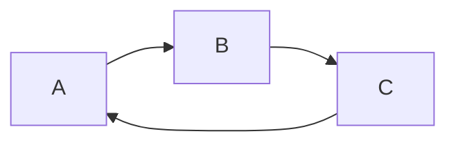

<!-- TODO: update commits timestamps [change timestamps while rebasing](https://stackoverflow.com/a/63751470), [Git rebase without changing commit timestamps](https://stackoverflow.com/a/2976598). -->
<!-- TODO: move 'Repository and docs' to extensions.md. -->

# Documentation <!-- omit in toc -->

Tips and tricks to work with Visual Studio Code and the extensions.

## Table of contents <!-- omit in toc -->

- [Visual Studio Code](#visual-studio-code)
  - [Portable mode](#portable-mode)
  - [Settings](#settings)
  - [Command palette](#command-palette)
    - [Key bindings](#key-bindings)
  - [Built-in](#built-in)
    - [Emmets](#emmets)
- [Extensions](#extensions)
  - [General (language independent)](#general-language-independent)
    - [Profile Switcher](#profile-switcher)
    - [Settings Sync](#settings-sync)
    - [Code Spell Checker](#code-spell-checker)
    - [Vscode Google Translate](#vscode-google-translate)
    - [Bookmarks](#bookmarks)
    - [Todo Tree](#todo-tree)
    - [Sort lines](#sort-lines)
    - [vscode-random](#vscode-random)
    - [Peacock](#peacock)
    - [Material Icon Theme](#material-icon-theme)
    - [Gremlins tracker for Visual Studio Code](#gremlins-tracker-for-visual-studio-code)
    - [Color Picker](#color-picker)
    - [VS Color Picker](#vs-color-picker)
    - [:emojisense:](#emojisense)
  - [General (languages)](#general-languages)
    - [EditorConfig for VS Code](#editorconfig-for-vs-code)
    - [Prettier - Code formatter](#prettier---code-formatter)
    - [SonarLint](#sonarlint)
    - [Sort JSON objects](#sort-json-objects)
    - [Rainbow CSV](#rainbow-csv)
  - [Web](#web)
    - [Debugger for Firefox](#debugger-for-firefox)
    - [Turbo Console Log](#turbo-console-log)
    - [Import Cost](#import-cost)
    - [Image preview](#image-preview)
  - [Angular](#angular)
    - [Angular Language Service](#angular-language-service)
    - [ESLint](#eslint)
    - [SimonTest](#simontest)
    - [Angular Snippets (Version 13)](#angular-snippets-version-13)
  - [Markdown](#markdown)
    - [Markdown All in One](#markdown-all-in-one)
    - [Markdown Preview Enhanced](#markdown-preview-enhanced)
    - [markdownlint](#markdownlint)
  - [Git](#git)
    - [GitLens — Git supercharged](#gitlens--git-supercharged)
    - [GitHub Pull Requests](#github-pull-requests)
    - [gitignore](#gitignore)
  - [Others](#others)
    - [Paste JSON as Code](#paste-json-as-code)
    - [Unicode code point of current character](#unicode-code-point-of-current-character)
    - [vscode-pandoc](#vscode-pandoc)
- [Links of interest](#links-of-interest)

## Visual Studio Code

<!-- TODO: add word in settings.json. -->

[Docs](https://code.visualstudio.com/docs).

### Portable mode

Follow these steps to use [VSC portable mode](https://code.visualstudio.com/docs/editor/portable):

- [Download](https://code.visualstudio.com/download) the `.zip` or `.tar.gz`.
- Unzip and create the `data` folder.
- Create `tmp` folder if you wish to also have `tmp` directory within the portable directory.

To update the portable version, copy or move the `data` folder over to a more recent version of VSC.

### Settings

Nearly all can be configured using `settings.json`. VSC provides two different scopes:

- User settings: stored in the application folder and apply globally.
- Workspace settings: stored in the `.vscode` project folder (at root). These override the user settings.

Some nice options to know:

- Navigation map: `editor.minimap.enabled`.
- Contextual information interspersed: `editor.codeLens`.
- Working with spaces or tabs: `editor.insertSpaces`, `editor.detectIndentation` and `editor.tabSize`. Usually this will be done by extensions like: Prettier or EditorConfig.
- Customize colors theme ([values](https://code.visualstudio.com/api/references/theme-color)): `workbench.colorCustomizations`.

### Command palette

Open the command palette using `Ctrl`+`Shift`+`P`.

- Developer: Reload Window: `Ctrl`+`R`.
- Transform to Uppercase/Lowercase. <!-- TODO:  Define Keybinding -->

#### Key bindings

Open keyboard shortcuts with: `Ctrl`+`K` `Ctrl`+`S`. In the `keybindings.json` file we can see the custom keys added. [Docs](https://vscode.readthedocs.io/en/latest/getstarted/keybindings/).

Keybinding list of important ones or most used:

| Shortcut                 | Description                  | Shortcut                  | Description                                             |
| ------------------------ | ---------------------------- | ------------------------- | ------------------------------------------------------- |
| `Ctrl`+`Shift`+`P`, `F1` | Show all commands (palette). | `Ctrl`+`G`                | Go to line/column.                                      |
| `Ctrl`+`K` `S`           | Save all.                    | `Alt`+`LeftArrow`         | Action back.                                            |
| `Ctrl`+`P`               | Search files.                | `Alt`+`RightArrow`        | Action forward.                                         |
| `Ctrl`+`Shift`+`F`       | Find in files.               | `Alt`+`UpArrow`           | Move line up.                                           |
| `Ctrl`+`D`               | Select next occurrence.      | `Alt`+`DownArrow`         | Move line down.                                         |
| `Ctrl`+`Shift`+`L`       | Select all occurrences.      | `Shift`+`Alt`+`UpArrow`   | Copy line up.                                           |
| `Ctrl`+`Alt`+`UpArrow`   | Add cursor above.            | `Shift`+`Alt`+`DownArrow` | Copy line down.                                         |
| `Ctrl`+`Alt`+`DownArrow` | Add cursor below.            | `Ctrl`+`Shift`+`M`        | Toggle problems (error, warning, info).                 |
| `Ctrl`+`Space`           | Trigger code suggest.        | `F8`                      | Go to next problem in files (error, warning, info).     |
| `Ctrl`+`K` `Z`           | Toggle zen mode.             | `Shift`+`F8`              | Go to previous problem in files (error, warning, info). |
| `Ctrl`+`Ñ`               | Toggle terminal.             | `Alt`+`F8`                | Go to next problem (error, warning, info).              |
| `Ctrl`+`Shift`+`Ñ`       | Create new terminal.         | `Shift`+`Alt`+`F8`        | Go to previous problem (error, warning, info).          |

<!-- TODO: fold and unfold. -->

### Built-in

#### Emmets

[Emmet Documentation](https://docs.emmet.io/), [Emmet in Visual Studio Code](https://code.visualstudio.com/docs/editor/emmet) and [examples](https://kungfupress.com/multiplica-tu-velocidad-en-visual-studio-code-utilizando-emmet/).

<!-- markdownlint-disable MD033 -->
<!-- TODO: use details? -->
<!--
<details>
<summary><code>p*2>lorem5</code></summary>

```html
<p>Lorem ipsum dolor sit amet.</p>
<p>Facere nesciunt at saepe praesentium?</p>
```

</details> -->

<!-- markdownlint-enable MD033 -->

<!-- </img> -->

```html
<!-- p*2>lorem5 -->
<p>Lorem ipsum dolor sit amet.</p>
<p>Facere nesciunt at saepe praesentium?</p>
```

```html
<!-- ul>li*3>span.myclass#myid>lorem2 -->
<ul>
  <li><span class="myclass" id="myid">Lorem, ipsum.</span></li>
  <li><span class="myclass" id="myid">Deleniti, itaque?</span></li>
  <li><span class="myclass" id="myid">Quis, perferendis.</span></li>
</ul>
```

```html
<!-- ul>li*2>(span.myclass#myid+div)*2 -->
<ul>
  <li>
    <span class="myclass" id="myid"></span>
    <div></div>
    <span class="myclass" id="myid"></span>
    <div></div>
  </li>
  <li>
    <span class="myclass" id="myid"></span>
    <div></div>
    <span class="myclass" id="myid"></span>
    <div></div>
  </li>
</ul>
```

```html
<!-- ul>li.item$@*3 -->
<!-- ul>li.item$@-*3 for countdown -->
<ul>
  <li class="item1"></li>
  <li class="item2"></li>
  <li class="item3"></li>
</ul>
```

## Extensions

If the opposite is not indicated, the configuration is set in `settings.json` file.

Below, there are an extensive list of extensions with their basic functionality and other information.

### General (language independent)

#### Profile Switcher

Control the extensions loaded with [profiles](https://www.aaron-powell.com/posts/2019-07-25-profile-switcher-extensions-support/). Set:

- `profileSwitcher.profiles`: names of saved profiles.
- `profileSwitcher.extensionsIgnore`: extensions available in all the profiles.
- `profileSwitcher.storage`: when creating a new profile, all the current settings are saved here and can be manually modified later.
- `profileSwitcher.extensions`: extensions for each saved profile.

```json
"profileSwitcher.profiles": ["Angular"],
"profileSwitcher.extensionsIgnore": [],
"profileSwitcher.storage": { "Angular": {} },
"profileSwitcher.extensions": { "Angular": [] }
```

[Repository and docs](https://github.com/aaronpowell/vscode-profile-switcher).

#### Settings Sync

Synchronize settings, snippets, themes, file icons, launch, keybindings, workspaces and extensions using GitHub gist. [Configuration](https://shanalikhan.github.io/2019/08/01/Settings-sync-configurations.html).

[Repository and docs](https://github.com/shanalikhan/code-settings-sync).

#### Code Spell Checker

<!-- TODO: create a cspell.json (or .vscode/cspell.json) file for configuration instead of using settings.json? -->

Spell checker for any type of file that works well with common case types. By default, not all the file types are checked, but can be configured using `enabledLanguageIds` or `enableFiletypes`.

The errors are shown with a squiggly underline. To see the suggestions list, place the cursor on the word and `Ctrl`+`.`.

Some important configuration options:

- `cSpell.words` or `cSpell.userWords`: add custom words to be valid.
- `cSpell.enabledLanguageIds`: list of enabled languages.
- `cSpell.enableFiletypes`: these types are merged with `enabledLanguageIds` list. To disable a type, prefix with `!`, e.g., `!json`. It is better to use this option to add some languages because using `enabledLanguageIds` all the languages to check should be added.

Configure dictionaries: [add-ons](https://github.com/streetsidesoftware/vscode-spell-checker/#add-on-language-dictionaries) and [custom dictionaries](https://github.com/streetsidesoftware/vscode-spell-checker/#how-to-add-your-own-dictionaries).

To see (and change) extension configuration: `Ctrl`+`Shift`+`P` and search `Show Spell Checker Configuration Info`, or click on the spell checker status on the status bar.

[Repository and docs](https://github.com/streetsidesoftware/vscode-spell-checker).

#### Vscode Google Translate

Translate text with multicursor support.

[Repository and docs](https://github.com/funkyremi/vscode-google-translate).

#### Bookmarks

Mark lines and move around. Basic keybindings:

- `Ctrl`+`Alt`+`K`: set bookmark.
- `Ctrl`+`Alt`+[`J`, `L`]: jump to previous and next.

[Repository and docs](https://github.com/alefragnani/vscode-bookmarks).

#### Todo Tree

Add tags like `TODO`, `BUG`, `FIXME` and display them in a tree view in the explorer pane.

Basic configuration:

- `todo-tree.general.tags`: list of tags.
- `todo-tree.highlights.defaultHighlight`: default configuration for highlighting tags.
- `todo-tree.highlights.customHighlight`: custom configuration for tag.

Example tags:

```txt
TODO: qwerty.
FIXME: qwerty.
BUG: qwerty.
CUSTOM: qwerty.
```

[Repository and docs](https://github.com/Gruntfuggly/todo-tree).

#### Sort lines

Sort lines of text with multiple methods: alphabetically, length, shuffle, etc.

[Repository and docs](https://github.com/Tyriar/vscode-sort-lines).

<!-- TODO: solve the multiple keybinding F9. -->

#### vscode-random

Generate random data: numbers, strings, colors, cities, etc.

[Repository and docs](https://github.com/jrebocho/vscode-random).

#### Peacock

Change the color of the workspace. Useful to identify the project when multiple instances of VSC are open.

[Repository](https://github.com/johnpapa/vscode-peacock) and [docs](https://papapeacockstorage.z13.web.core.windows.net/).

#### Material Icon Theme

Folder and file icons theme.

Activate the extension: `"workbench.iconTheme": "material-icon-theme"`.

[Repository and docs](https://github.com/PKief/vscode-material-icon-theme).

#### Gremlins tracker for Visual Studio Code

Display gremlins: invisible and ambiguous unicode characters. By default, these are shown with a gremlin icon in the gutter, and can be shown in the _Problems pane_ configuring `"gremlins.showInProblemPane": true`. Another useful option is to define a list of additional characters with `gremlins.characters`.

[Repository and docs](https://github.com/nhoizey/vscode-gremlins).

#### Color Picker

Improved color palette GUI and multicursor actions: `Pick Color` and `Convert Color`.

[Repository and docs](https://github.com/anseki/vscode-color).

#### VS Color Picker

Color picker with palette and color chooser tool that allows you to pick a color from screen.

[Repository and docs](https://github.com/leehooi/vs-color-picker).

#### :emojisense:<!-- markdownlint-disable-line MD026 -->

Add emoji suggestions and autocompletion.

[Repository and docs](https://github.com/mattbierner/vscode-emojisense).

### General (languages)

#### EditorConfig for VS Code

Enable EditorConfig support. It overrides user and workspace settings with the ones found in `.editorconfig` file.

Configuration file: `.editorconfig`.

[Repository and docs](https://github.com/editorconfig/editorconfig-vscode).

#### Prettier - Code formatter

Format code of multiple languages: TypeScript, HTML, SCSS, Java, JSON and JSONC, etc. Configuration files: `.prettierrc` and `.prettierignore`.

[Integration with linters (ESLint and Stylelint)](https://prettier.io/docs/en/integrating-with-linters.html).

[Repository and docs](https://github.com/prettier/prettier-vscode).

<!-- Prettier can not format `settings.json`: issue [#1032](https://github.com/prettier/prettier-vscode/issues/1032#issuecomment-579504800). -->

#### SonarLint

Identify and help to fix quality and security issues while coding. The list of available rules is visible in the explorer.

Some languages have some requirements to run code analysis:

- Node.js for JavaScript and TypeScript.
- [Language Support for Java(TM) by Red Hat](https://marketplace.visualstudio.com/items?itemName=redhat.java) for Java.

Configure Node.js path with: `sonarlint.pathToNodeExecutable`.

It is possible to configure SonarQube and SonarCloud.

[Repository and docs](https://github.com/SonarSource/sonarlint-vscode).

#### Sort JSON objects

Sort keys in selected JSON objects with multiple methods: alphabetically, key length, reverse, etc. The selected JSON can be a child but should be valid.

An interesting configuration option is `sortJSON.orderOverride` (`orderUnderride` for the opposite) that allows to define some specific order, e.g., to show always the `b` key at the beginning: `"sortJSON.orderOverride": ["b"]`.

[Repository and docs](https://github.com/richie5um/vscode-sort-json).

#### Rainbow CSV

Add key features to work with _separated value_ files: highlight and align columns, select column, run queries in SQL-like language, CSVLint, etc.

Separators:

- Default configured separators: `,`, `\t`, `;`, `|`.
  <!-- markdownlint-disable-next-line MD038 -->
- Supported separators: `,`, `\t`, `;`, ` `, `|`, `~`, `^`, `:`, `"`, `=`, `.`, `-`. By default, only the _default separators_ are used, but the supported separators can be added using `rainbow_csv.autodetect_separators` configuration option. No others separators can be used.

The automatic detection is run when the file is opened and sometimes this does not work, but it can be fixed by closing and opening the file again or restarting VSC.

[Repository and docs](https://github.com/mechatroner/vscode_rainbow_csv).

### Web

#### Debugger for Firefox

<!-- TODO: create launch example. -->

Use Firefox to debug web applications.

[Repository and docs](https://github.com/firefox-devtools/vscode-firefox-debug).

#### Turbo Console Log

Add console log messages with scope information, e.g., `<class name> -> <function name> -> <var name> <value>`. Multicursor support.

To add an automatic log:

- Select or hover a variable or method.
- `Ctrl`+`Alt`+`L`.

<!-- TODO: solve the multiple keybinding Ctrl+Alt+L. -->

[Repository and docs](https://github.com/Chakroun-Anas/turbo-console-log).

#### Import Cost

Display inline the size of the imported package.

[Repository and docs](https://github.com/wix/import-cost).

#### Image preview

Show image preview in the gutter and on hover. Works with URL and relative paths.

[Repository and docs](https://github.com/kisstkondoros/gutter-preview).

### Angular

#### Angular Language Service

Add important functionalities when editing template files: code completion, AOT messages, go to definition, and more.

[Repository and docs](https://github.com/angular/vscode-ng-language-service).

#### ESLint

Integrate ESLint in VSC. Use local or global installed version of ESLint: `npm install eslint` (or with `-g` for global install).

[Repository and docs](https://github.com/Microsoft/vscode-eslint).

#### SimonTest

Support test creation: create basic tests, configure `TestBed` and mock dependencies.

[Repository and docs](https://github.com/SimonTestNet/SimonTest).

#### Angular Snippets (Version 13)

Add code snippets for TypeScript and HTML.

[Repository and docs](https://github.com/johnpapa/vscode-angular-snippets).

### Markdown

Pandoc have some install requirements to work with it: [Pandoc](https://pandoc.org) and [MiKTeX](https://miktex.org/) (for _pdflatex_).

Good to know:

- LaTeX math expressions:

  | Expression type | Code                                           | Output                                      |
  | --------------- | ---------------------------------------------- | ------------------------------------------- |
  | Inline          | Text: `$a^{12}$`, `$a_{34}$`, `$a^{56}_{78}$`. | Text: $a^{12}$, $a_{34}$, $a^{56}_{78}$.    |
  | Block           | Text: `$$\sum^{n}_{i=1} i=\frac{n(n+1)}{2}$$`  | Text: $$\sum^{n}_{i=1} i=\frac{n(n+1)}{2}$$ |

<!-- TODO: solve the multiple keybinding Ctrl+K V. -->

#### Markdown All in One

Add extra features to Markdown files: keyboard shortcuts with multicursor support for: bold, italics, etc., table of contents, list editing and export to HTML with _Markdown: Print current document to HTML_ command.

[Repository and docs](https://github.com/yzhang-gh/vscode-markdown).

#### Markdown Preview Enhanced

Basic features: export to different outputs (PDF, HTML, image,...), math expressions, flow charts, sequence diagrams, graphs, run code chunks. It is better to export with _Chrome (Puppeteer)_ because it prints the diagrams (unlike Pandoc and others).



Enable execution of code chunks with `enableScriptExecution`, but do it with caution because of security risks.

```javascript {cmd="node"}
console.log(new Date(Date.now()).toLocaleString());
```

Enable table extended syntax with `enableExtendedTableSyntax` to create tables with merged columns or rows.

| Merge columns                           | @   | @                                          | @          |            |
| --------------------------------------- | --- | ------------------------------------------ | ---------- | ---------- |
| >                                       | >   | Option 1: write `>` in the before columns. | New column | New column |
| Option 2: leave the next columns empty. |     |                                            |            | New column |

| Merge rows                              |     |
| --------------------------------------- | --- |
| Option 1: write `^` in the merged rows. | A   |
| ^                                       | B   |
| ^                                       | C   |
| New row group                           | D   |
| ^                                       | E   |
| New row                                 | F   |
| New row                                 | ^   |

Additional features:

- Superscript: ^super^ (`^super^`).
- Footnotes: write `[^N]` and then in a new line `[^N]: text.`:
  <!-- markdownlint-disable-next-line MD031 -->
  ```text
  Some text [^1].
  [^1]: text.
  ```

[Repository](https://marketplace.visualstudio.com/items?itemName=shd101wyy.markdown-preview-enhanced) and [docs](https://shd101wyy.github.io/markdown-preview-enhanced/#/).

#### markdownlint

Linting and style checking for Markdown. It shows warnings for violated rules and can fix automatically some of these:

- Open command palette and search for _Fix all supported markdownlint violations in the document_.
- Another option is to configure a save action:
  <!-- markdownlint-disable-next-line MD031 -->
  ```json<!-- markdownlint-disable-line no-space-in-emphasis -->
  "editor.codeActionsOnSave": {
    "source.fixAll.markdownlint": true
  }
  ```

[Repository and docs](https://github.com/DavidAnson/vscode-markdownlint).

### Git

#### GitLens — Git supercharged

Improve Git interaction adding visual features for: revision navigation, current line blame,

[Repository and docs](https://github.com/gitkraken/vscode-gitlens).

#### GitHub Pull Requests

Review pull requests within VSC.

[Repository and docs](https://github.com/Microsoft/vscode-pull-request-github).

#### gitignore

Add support for `.gitignore` files: create or update `.gitignore` file using [github/gitignore](https://github.com/github/gitignore) template.

[Repository and docs](https://github.com/CodeZombieCH/vscode-gitignore).

### Others

Barely used extensions or not really needed.

#### Paste JSON as Code

Convert JSON to different languages creating the classes to serialize and deserialize the object. It supports: TypeScript, Java, Kotlin, Python, etc.

Actions:

- Generate code from a JSON file: open the file, open the command palette and select `Open quicktype for JSON`.
- Generate code from clipboard: copy the JSON, open the command palette and select `Paste JSON as Code`.

Change the target language with command palette and select `Set quicktype target language`.

[Repository and docs](https://github.com/quicktype/quicktype).

#### Unicode code point of current character

Show unicode value for the current character.

[Repository and docs](https://marketplace.visualstudio.com/items?itemName=zeithaste.cursorCharCode).

#### vscode-pandoc

Convert Markdown files to other extensions like PDF or HTML.

[Repository and docs](https://github.com/dfinke/vscode-pandoc).

<!-- ## Summary

Summary table with all the extensions, their action name (accessed with `Ctrl`+`Shift`+`P`) and their `settings.json` name.

| Extension                                                                           | Action name      | Important actions `Ctrl+Shift+P` |
| ----------------------------------------------------------------------------------- | ---------------- | -------------------------------- |
| [Profile Switcher](#profile-switcher)                                               | Profile Switcher | @                                |
| [Settings Sync](#settings-sync)                                                     | @                | @                                |
| [Vscode Google Translate](#vscode-google-translate)                                 | @                | @                                |
| [Bookmarks](#bookmarks)                                                             | @                | @                                |
| [Todo Tree](#todo-tree)                                                             | @                | @                                |
| [Sort lines](#sort-lines)                                                           | @                | @                                |
| [vscode-random](#vscode-random)                                                     | @                | @                                |
| [Peacock](#peacock)                                                                 | @                | @                                |
| [Material Icon Theme](#material-icon-theme)                                         | @                | @                                |
| [Gremlins tracker for Visual Studio Code](#gremlins-tracker-for-visual-studio-code) | @                | @                                |
| [Color Picker](#color-picker)                                                       | @                | @                                |
| [VS Color Picker](#vs-color-picker)                                                 | @                | @                                | -->

## Links of interest

- [Visual Studio Code - Docs](https://code.visualstudio.com/docs)
- [User and Workspace settings](https://code.visualstudio.com/docs/getstarted/settings)
  - [Default values settings.json](https://code.visualstudio.com/docs/getstarted/settings#_default-settings)
- [Visual Studio Code Tips and Tricks](https://code.visualstudio.com/docs/getstarted/tips-and-tricks)
- [Extension API](https://code.visualstudio.com/api)
  - [Color theme](https://code.visualstudio.com/api/references/theme-color)
- [Extensions documentation](https://code.visualstudio.com/docs/editor/extension-gallery)
- [VS Code can do that?!](https://vscodecandothat.com/)

<!-- ## Resources -->
<!-- TODO: add resources with: [<extension_name>](<link>) [DOC](<link>) -->
